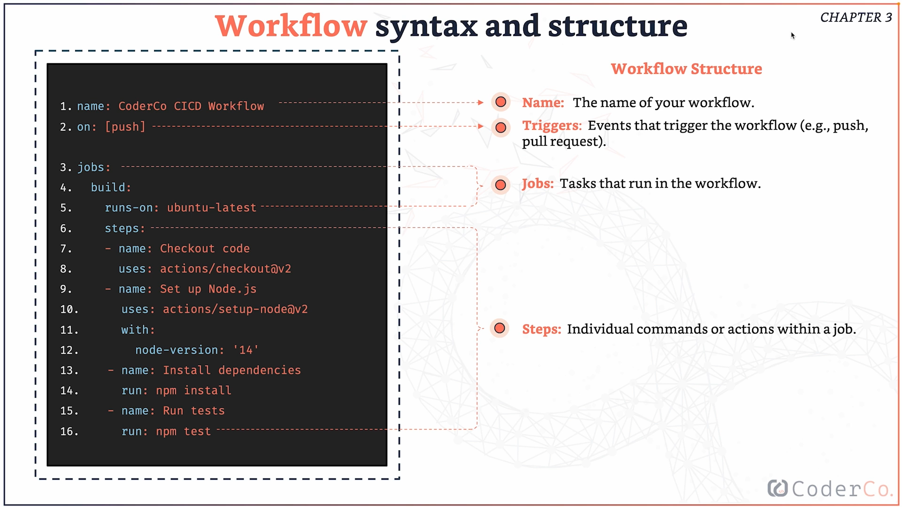

# DevOps-Learning-CI-CD
Repository containing topics I learnt in the CoderCo CICD Module.

## What is CICD?
- CI: Continuous Integration - The practice of automatically integrating code changes from multiple contributors into a shared repository several times a day.
- CD: 
    - Continuous Deployment - Automatically releasing every change that passes all stages of the production pipeline
    - Continuous Delivery - Ensuring the software can be reliably released at any time.
    
## Why is CICD important?
- Faster Delivery: due to automating processes and delivery
- Improved Quality: due to continuously testing and integrating code
- Reduced Risk: due to smaller changes being tested and integrated rather than large changes
- Better Collaboration: Fewer conflicts and better communication

## Github Actions Workflow Syntax and Structure
Must have a workflow file which is a YAML file and is usually located in the .github/workflows. A breakdown of the workflow can be seen below:

- Events: Actions that trigger workflows (e.g. push, pull request, schedule)
- Jobs: 
    - Independant tasks that run in parallel or sequentially
    - Each job runs on a Virtual Machine
- Steps:
    - Individual commands or actions executed in the job.
    - Steps run sequentially within a job